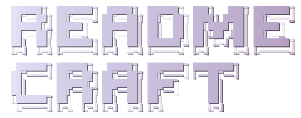

# readme-craft

A GitHub-native, layout-first README generation and improvement skill for AI agents. Produces structured, scannable READMEs with a 3-tier information hierarchy designed for how GitHub READMEs are actually consumed.

This skill is a standalone utility. It does NOT depend on skill-forge or any other skill. Higher-level tools (like skill-forge) may optionally delegate to readme-craft for layout and badge decisions.

## Execution Procedure

```python
def readme_craft(project_path, user_request):
    # STEP 0: Dependencies
    run("scripts/setup.sh")                                    # exit non-zero → STOP

    # STEP 1: Scan
    state = scan_project(project_path)                         # see Scan section
    # state = {has_readme, has_logo, has_codebase, has_skill_md, ...}

    # STEP 2: Gather
    if state.has_codebase:
        info = derive_from_code(state)                         # see Gather section
    else:
        info = ask_user("name, one-liner, features, license")
    info += ask_targeted_questions(state, max=4)               # only when scan can't decide

    # STEP 3: README Content
    if state.has_readme and user_said("start fresh"):
        facts = extract_facts(state.readme)                    # carry forward, discard structure
        state.has_readme = False

    if state.has_readme:
        plan = evaluate(state.readme, "3-Tier Layout + Quality Checklist")  # see 3-Tier section
        if state.has_skill_md: assert_distinct_operations(plan, "Quick Start")
        confirm_plan_with_user(plan)                           # HITL — or apply if "just fix it"
        readme = apply_improvements(state.readme, plan)        # see Tone & Voice section
    else:
        template = "assets/skill-readme.md" if state.has_skill_md else "assets/universal-readme.md"
        readme = fill_template(template, info)

    # STEP 4: Logo
    if state.has_logo:
        readme = insert_picture_element(readme, state.logo)    # see Dark/Light Mode Logo section
    else:
        candidates = run(f'node scripts/generate-logo.mjs --candidates 5 --name "{info.name}"')
        present_paths_to_user(candidates)                      # HITL — user picks
        selected = wait_for_user_selection()                   # references/logo-generation.md
        copy_to(".github/logo-light.svg", generate_dark(".github/logo-dark.svg"))
        if wordmark_spells_name(selected): omit_h1()

    # STEP 5: Formatting & Badges
    readme = apply_3tier_layout(readme)                        # see The 3-Tier Layout Strategy
    readme = apply_github_formatting(readme)                   # references/github-formatting.md
    readme = select_and_apply_badges(readme, state)            # see Badge Selection + references/badges.md
    if state.has_git_remote:
        star_count = gh_api_star_count(state.remote)           # gh api repos/{owner}/{repo} --jq .stargazers_count
        if star_count >= 100:
            if ask_user(f"This repo has {star_count}⭐ — add a star history chart?"):  # HITL
                readme = insert_star_history(readme, state.remote)  # references/badges.md § Star History
    readme = apply_tone_voice(readme)                          # see Tone & Voice section

    # STEP 6: Quality Check
    # Pass 1: structural
    findings = run_checklist(readme, "dimensions 1-5")         # references/quality-checklist.md
    report_to_user(findings)
    readme = fix(readme, findings)
    assert run_checklist(readme, "dimensions 1-5").all_pass

    # Pass 2: reader lens
    reader_findings = run_checklist(readme, "dimension 6")     # different mindset — stranger perspective
    readme = fix(readme, reader_findings)

    # STEP 7: GitHub Metadata
    validate_or_create_metadata(state)                         # references/github-metadata.md
    assert metadata_file_valid(state)                          # GATE — .github/repo-meta.yml must exist with valid description + topics
    if state.has_git_remote:
        apply_metadata_to_remote(state)                        # gh repo edit --description + --add-topic

    # STEP 8: Deliver
    readme = add_footer(readme, state)                         # "Crafted with Readme Craft"
    readme = remove_sections_user_declined(readme)
    present_final(readme)

    # STEP 9: Comparison (when improving an existing README)
    if state.has_readme and state.original_readme:
        generate_comparison(state.original_readme, readme)     # references/comparison-screenshots.md
```

---

## When to Use

Activate this skill when the user says any of:

- "Write a README for this project"
- "Generate a README"
- "Create a README from scratch"
- "Improve this README"
- "Review my README"
- "Make my README better"
- "Add badges to my README"
- "Fix my README layout"
- Any request involving README creation, evaluation, or improvement

---

## Scan

Scan the project to understand current state:

- Check for existing README
- Check for existing logo files in `.github/` first, then repo root (`logo-light.svg`, `logo-dark.svg`, `logo.svg`, `logo.png`). Canonical location: `.github/`
- Read `package.json`, `Cargo.toml`, `pyproject.toml`, `go.mod`, `SKILL.md` frontmatter, or equivalent for name, version, description, license, dependencies
- Read existing docs (`CONTRIBUTING.md`, `CHANGELOG.md`, `LICENSE`) if present
- Read the entry point and key source files to understand what the project does
- Read CI config (`.github/workflows/`, `.gitlab-ci.yml`) to determine build/test commands
- List directory structure (top 2 levels)

Record findings as project state: `{has_readme, has_logo, has_codebase, has_skill_md, ...}`

## Gather

- `has_codebase` → derive name, description, features, install commands from code
  - Derive the one-liner from package description + source code understanding
  - Derive features from exports, CLI commands, API surface, or SKILL.md capabilities
  - Derive install commands from package manager config or skill registration patterns
  - Derive quick-start from examples/ directory, tests, main entry point, or install command. For general projects: install command + minimal code snippet or one CLI invocation. For skill projects (`has_skill_md`): list distinct operations from SKILL.md workflow modes — one canonical trigger phrase + outcome per operation. Phrasing variations of the same operation go in Usage, not Quick Start
- `!has_codebase` → ask user for: project name, one-liner, key features, license
- Either way: ask up to 4 targeted questions only when the scan cannot safely decide:
  - should social proof appear in the README
  - should deep content move to `docs/`
  - should a diagram be added
  - should an existing voice or visual style be preserved strictly

---

## What a README Is — and Is Not

A README is a storefront, not a documentation site. In the Diátaxis framework (tutorials, how-to guides, reference, explanation), a README does not belong to any single type. It borrows elements from several:

- **Explanation** → Why / The Problem
- **How-to** → Quick Start, Install, Usage
- **Reference** → Tier 3 supporting content (inline or linked to `docs/`)

But a README has a mission that none of the four types cover: **convince**. The Features section exists to sell — to make a reader believe this project is worth their time in the fewest possible words. Features answer "what do I get?", not "how does it work internally?" or "why was it designed this way?"

The structural principle behind the 3-tier system is **progressive disclosure**: reveal only what each visitor needs at their current level of commitment. Tier 1 is for the uncommitted (pitch), Tier 2 is for the evaluating (proof), Tier 3 is for the committed (reference). Every placement decision — "does this belong above the fold or at the bottom?" — is a progressive disclosure decision. Scrolling is the disclosure mechanism, not collapsing.

| Concept | Question it answers | Example |
|---------|-------------------|---------|
| **Features / Highlights** | "What do I get?" | "Scans your codebase and auto-generates a README" |
| **How It Works** | "How does it run internally?" | "Config → Gather → Create → Validate → Publish" |
| **Why / The Problem** | "Why do I need this?" | "Your skill is trapped in one project and can't be shared" |

When Features and How It Works are mixed together, the README writes out a pipeline instead of selling capabilities.

---

## The 3-Tier Layout Strategy

This is the primary differentiator of readme-craft. Every README must organize content into three tiers based on how visitors consume information.

This strategy is optimized for **GitHub** README rendering. Elements like `<picture>` and similar GitHub-specific patterns may not render on other platforms (GitLab, npm, crates.io). Adapt as needed.

### Tier 1: Above the Fold (~250px)

The first screen a visitor sees. This is the 3-second pitch. Visitors who are not interested will leave after this.

**Baseline elements (in order):**

1. **Logo** — centered, 80-120px height. Use existing if found, generate if not (see Step 4). Use `<picture>` for dark/light mode (see below).
2. **Project name** — `<h1>`, centered.
3. **One-liner** — a value proposition, not a technical description. Answer "why should I care?", not "what technology is this?" Example: ✓ "Stop writing validation logic by hand" vs ✗ "A TypeScript library for form validation."
4. **Badges** — up to 6, on 1-2 lines. Trust signals: license, version, build status, downloads. Fewer is fine when fewer apply.
5. **Quick action links** — inline links to the most relevant next actions (for example Quick Start, Usage, Install, Docs, Demo, Report Bug).

Additional brief elements (a platform compatibility line, a short tagline, a small demo gif) are fine as long as Tier 1 stays within ~250px and reads as a single visual block.

**Rules:**
- The constraint is **height and density**, not element count. Stay within ~250px.
- No walls of text above the fold.
- Logo must be compact (not a full-width banner).
- The one-liner must answer "why should I care?" not "what technology is this?"
- No installation instructions in Tier 1.

**Markdown pattern (standard):**

```html
<div align="center">
  <picture>
    <source media="(prefers-color-scheme: dark)" srcset=".github/logo-dark.svg">
    <source media="(prefers-color-scheme: light)" srcset=".github/logo-light.svg">
    
  </picture>

  <h1>project-name</h1>
  <p>One-liner value proposition</p>
</div>

<div align="center">

[![License: MIT][license-shield]][license-url]
[![Version][version-shield]][version-url]
[![Build][build-shield]][build-url]

</div>

<div align="center">
  <a href="#quick-start">Quick Start</a> &middot;
  <a href="https://docs-url">Docs</a> &middot;
  <a href="https://demo-url">Demo</a>
</div>
```

**Alternate pattern (wordmark logos):**

When a wide wordmark (400-500px) serves as both logo and project name, the standard `<p>` inside `<div>` can feel cramped. Use a `>` blockquote after the closing `</div>` instead — it adds visual separation between the wordmark and the one-liner.

```html
<div align="center">
  <picture>
    <source media="(prefers-color-scheme: dark)" srcset=".github/logo-dark.svg">
    <source media="(prefers-color-scheme: light)" srcset=".github/logo-light.svg">
    
  </picture>
</div>

<!-- badges and quick links divs here -->

> One-liner value proposition
```

Use the standard `<p>` pattern by default. Switch to blockquote only when the wordmark is wide enough to make the centered `<p>` feel visually crowded.

### Tier 2: Scan Quickly

The next 2-3 screens. A visitor who passed Tier 1 wants to evaluate whether this project is worth adopting.

**Showcase Image** — For tools that produce visual transformations, place a before/after or hero image immediately after Tier 1's `---` separator, before the first `##` heading (or as the first element of Tier 2). This is a "show don't tell" proof that's more convincing than any text description. Skip ONLY when: project has no visual transformation (CLI tools, libraries, pure APIs).

**Required sections (in order):**

1. **Why / The Problem** — 2-4 sentences. What pain point does this solve? A strong Problem section lets readers self-qualify: "If [your situation], you need this." If the project serves multiple user segments (e.g., "haven't started yet" vs "already deployed"), address each briefly rather than blending into one generic statement.
2. **Features / Highlights** — bullet list, benefit-oriented. Each item answers "what does the user get?", not "how does it work internally?" Write in benefit-oriented language ("scans your codebase and auto-generates a README"), not mechanism-oriented language ("uses AST parsing to extract function signatures"). If you find yourself describing pipeline stages or internal steps, move that to How It Works in Tier 3.
   - **Scope:** 3-6 items for focused projects; scale to 7-10 for feature-rich projects. The goal is comprehensive coverage — do not cherry-pick a few capabilities and silently drop the rest. When the project has many features, group related capabilities into single items or use sub-descriptions rather than omitting.
   - **Ordering:** Most important and most innovative capabilities first. Lead with what makes this project unique, not with table-stakes features every similar tool has.
   - **Comprehensiveness check:** Read through all source files, reference docs, and config to inventory every user-facing capability. Then confirm every major capability appears in the Features list — either as its own item or clearly covered within another item.
3. **When to Use** — include for tools and skills. Skip ONLY when: the Usage section already covers activation context. Clarify what situation should prompt the reader to reach for this project. If there's a specific activation model ("use after X, not during Y") or a "not for" boundary, state it here. Can be combined into Usage if short.
4. **Quick Start** — the fastest path to a working example. 1-3 commands + minimal code (5-15 lines).
5. **Install** — primary installation method inline. Alternative methods: short → inline below primary; long → `docs/install-alternatives.md` with teaser.
6. **Usage** — basic example + 1-2 common use cases. Advanced examples: short → inline; long → `docs/` with teaser.

**Rules:**
- Each section must fit on one screen or less.
- Use code blocks aggressively — they scan faster than prose.
- Bullet lists over paragraphs.
- If a section exceeds one screen, move detail into a linked doc (`docs/`).

For AI agent skills, "Usage" (trigger phrases) may come before "Install" to prioritize understanding over commitment. The skill template reflects this ordering.

### Tier 3: Supporting Content

Sections below Tier 2 that serve committed users. Position at the bottom of README provides natural progressive disclosure — **scrolling is the disclosure mechanism**, not collapsing.

**The Checkout Test — the operational criterion for every section:**

> If this section disappeared from the README, would a potential user be **less likely** to `git clone` or `npm install` the project?
>
> - **Yes** → keeps the section inline in README
> - **No** → section moves to `docs/` with a teaser link

Three content types pass the Checkout Test:

1. **Feasibility gates** — "Can I use this?" (Prerequisites, primary Install, License)
2. **Value proposition** — "Should I use this?" (Why, Features, Quick Start, When to Use)
3. **Trust signals** — "Can I trust this?" (Badges, social proof)

Everything else is post-decision content: "how to use it better" or "how it works internally." Removing it would not change whether someone tries the project.

**Section-by-section reference:**

| Section | Passes Checkout Test? | Category | Placement |
|---------|:---:|------|-----------|
| Why / Problem | Yes | Value proposition | Tier 2 inline |
| Features | Yes | Value proposition | Tier 2 inline |
| Quick Start | Yes | Value proposition | Tier 2 inline |
| When to Use / Not-for | Yes | Value proposition | Tier 2 inline |
| Install (primary) | Yes | Feasibility gate | Tier 2 inline |
| Prerequisites | Yes | Feasibility gate | inline |
| License | Yes | Feasibility gate | inline |
| Install (alternatives) | No | Post-decision (exploring options) | teaser + `docs/` |
| How It Works | No | Post-decision (curiosity) | teaser + `docs/` |
| Configuration (full) | No | Post-decision ("configurable" helps; full table doesn't) | teaser + `docs/` |
| API Reference | No | Post-decision | teaser + `docs/` |
| Project Structure | No | Post-decision (contributor info) | teaser + `docs/` |
| Development | No | Post-decision (contributor info) | teaser + `docs/` |
| Contributing | No | Post-decision (contributor info) | inline or CONTRIBUTING.md |
| Changelog / Roadmap | No | Post-decision (existing users) | teaser + `docs/` or link |
| Acknowledgments | No | Post-decision (courtesy, usually very short) | inline |

**No `<details>`.** Zero. If content is worth including, show it inline. If it's too long for README, move it to `docs/` as a complete, self-contained document. No folding, no collapsing.

**Teaser + link pattern** — substantive summary, not "learn more":

```markdown
## How It Works

skill-forge validates structure, security, and claims in a single pass
by reading every file in your skill repo.

→ [Architecture deep dive](docs/how-it-works.md)
```

**HITL:** readme-craft proposes moves ("suggest moving How It Works to `docs/how-it-works.md`"). The user confirms before execution. Never auto-move content out of README.

**Rules:**
- Non-decision sections → `docs/` with teaser. Exception: very short sections (< 5 lines, e.g., Acknowledgments, License) stay inline.
- Teaser = 1-3 substantive sentences + `→ [Title](docs/X.md)` link. The teaser IS the summary for anyone who doesn't click.
- Contributing: inline or CONTRIBUTING.md — not `docs/`.
- Add a back-to-top link for READMEs exceeding 300 lines.
- Use reference-style link definitions at the bottom of the file for badge URLs.

---

## Badge Selection

Choose badges based on the project's ecosystem and maturity. Up to 6 badges; fewer is fine when fewer apply.

**Priority order (pick from top, stop at 6):**

| Priority | Badge | When to Include |
|----------|-------|-----------------|
| 1 | License | Always |
| 2 | Version / Release | Always (npm, PyPI, crates.io, or GitHub release) |
| 3 | Build / CI status | If CI is configured |
| 4 | Downloads | If published to a package registry |
| 5 | Coverage | If coverage reporting is set up |
| 6 | Platform / ecosystem | If relevant (e.g., Agent Skills compatible, Node.js version) |

**Badge sources:**
- shields.io — the standard for most badges
- GitHub Actions badge URLs — for CI status
- Custom badges — only if shields.io does not cover the case

**Format:** Use reference-style links at the bottom of the README to keep the source markdown clean.

```markdown
[![License: MIT][license-shield]][license-url]

<!-- at bottom of file -->
[license-shield]: https://img.shields.io/github/license/org/repo.svg
[license-url]: https://github.com/org/repo/blob/main/LICENSE
```

For copy-paste badge patterns organized by ecosystem, see `references/badges.md`.

---

## Dark/Light Mode Logo

GitHub supports theme-aware images via the `<picture>` element. Always include this pattern when the project has a logo.

**The pattern:**

```html
<picture>
  <source media="(prefers-color-scheme: dark)" srcset=".github/logo-dark.svg">
  <source media="(prefers-color-scheme: light)" srcset=".github/logo-light.svg">
  
</picture>
```

**Rules:**
- Prefer SVG for logos (scales cleanly, small file size).
- The `` fallback uses the light variant (GitHub default theme).
- Store logos in `.github/` (per skill-forge asset placement convention: logo and screenshots are repo infrastructure, not skill runtime content).
- If the project only has one logo, use the same path for both `srcset` values and the `src` — still include the `<picture>` wrapper so a dark variant can be added later without restructuring.
- Width 80-120px for inline logos (icon/symbol marks). Wordmark logos (text-rendered SVGs like figlet/cfonts output) may use 400-500px width since they serve as both logo and project name. Never use full-width banners in Tier 1.
- If no logo exists yet, generate one (see Step 4). Every delivered README includes a logo.

**Fallback wordmarks:**

- If the project has no logo, generate logo candidates using `--candidates N` mode instead of silently picking one preset.
- Present absolute file paths to the user for preview. Let them choose.
- Use `--random` mode only when the user explicitly says "surprise me" or "just pick one".
- For a visual gallery of all available presets and palettes, see `docs/logo-gallery.md`.
- Prefer visually single-line wordmarks for README headers. If a preset reads like stacked block art or creates a double-title feel, switch to an inline treatment.
- If the generated wordmark already renders the project name clearly, omit the duplicated `<h1>` by default unless the user explicitly wants both.
- For preset selection rules and examples, see `references/logo-generation.md` and `references/logo-examples.md`.

---

## GitHub-Native Formatting Decisions

Use GitHub-specific formatting when it improves comprehension, not because it exists.

For syntax patterns and deeper rules, see `references/github-formatting.md`.

**Default patterns:**

- Relative links for `docs/`, sibling markdown files, and split reference material
- Teaser + `docs/` link for long non-decision content
- Tables for structured data
- Minimal HTML where Markdown is not enough (e.g., `<picture>` for dark/light logos)

**Optional patterns:**

- Mermaid diagrams for architecture, flow, sequence, timeline, or dependency relationships
- Task lists for roadmap or status
- Footnotes for citations and side notes
- Math expressions for technical projects that genuinely need formulas
- Social proof elements such as contributor widgets or star counts

**Rules:**

- Do not move decision-making content (Tier 2 sections) to `docs/` — it must stay inline.
- Use relative links when splitting a long README into `docs/` or separate markdown files.
- Add diagrams only when they explain faster than prose.
- Add social proof only when the repo is public, the numbers are real, and the user wants it.
- Prefer clarity over visual novelty.

---

## docs/ Content Standard

`docs/` exists to serve README. When a non-decision section is moved out of README, the full content goes to a `docs/` file. readme-craft creates these files as part of README improvement — it does not manage or reorganize existing project documentation.

**Boundary:** `docs/` is a human-facing layer. It must NOT be referenced by SKILL.md, `references/`, or any agent-facing instruction file. For skill repos: agent-relevant content belongs in SKILL.md + `references/`; `docs/` is for humans who want depth beyond what README shows.

**Naming:** kebab-case by topic (`how-it-works.md`, `configuration.md`). Keep `docs/` flat. Every file should be self-contained — readable without the README.

**Scale:** Most small projects need 0 docs. Don't create `docs/` preemptively. Only create files when moving content out of README. If a project has no non-decision sections longer than ~15 lines, it doesn't need `docs/`.

---

## Tone & Voice

When writing README content, follow these guidelines:

- Address the reader as **"you"** — not "the user" or "one."
- Refer to the software in **third person** — "readme-craft generates..." not "we generate..."
- **Value proposition over technical description** — lead with what the reader gains, not what the software is.
- **Professional but direct** — no exclamation marks, no emoji, no hype words ("revolutionary", "blazing fast").
- **Concise** — if a sentence doesn't add information, cut it.

When improving an existing README, these guidelines are recommendations, not overrides. Preserve the author's existing voice unless they explicitly ask for a tone change.

---

## Example Provenance

When including an Example section in a README:

- If the example comes from a real run, keep paths, commands, and outputs specific.
- If the example is a sample flow, say so explicitly.
- Never present unverified repo URLs, release pages, docs links, or install commands as if they already exist.

---

## Quality Checklist

Run the checklist in `references/quality-checklist.md` before delivering any README. Report failures to the user.

The checklist covers 6 dimensions: Structure (7), Content (13), Formatting (10), User Perspective (5), Completeness (6), Reader Lens (4) — 45 checks total. Dimensions 1-5 are structural; dimension 6 requires a mindset shift to first-time reader perspective.

---

## References

This skill uses the following template and analysis files:

| File | Purpose |
|------|---------|
| `assets/universal-readme.md` | Base template for any OSS project. Contains all three tiers with placeholder markup. |
| `assets/skill-readme.md` | Extended template for AI agent skills. Adds Agent Skills badge, trigger phrases, `npx skills add` install, and "What's Inside" section. |
| `references/badges.md` | Copy-paste badge patterns for shields.io, organized by category (license, version, CI, downloads, coverage, platform, Agent Skills). |
| `references/github-formatting.md` | GitHub-native formatting patterns, overflow strategy, and rules for diagrams, footnotes, math, task lists, and social proof. |
| `references/logo-generation.md` | README fallback logo guidance: positioning, preset selection, runtime requirements, and when to use the local wordmark generator. |
| `references/logo-examples.md` | Short example mappings from project feel to recommended logo presets. |
| `references/quality-checklist.md` | 45-point quality checklist across 6 dimensions: structure, content, formatting, user perspective, completeness, reader lens. |
| `references/gradient-palettes.md` | 2026-curated gradient palette reference with 45 named gradients for logo and badge color selection. |
| `references/comparison-screenshots.md` | Before/after comparison PNG generation via Playwright for README case studies. |
| `references/github-metadata.md` | GitHub repository metadata: About/description rules (≤350 chars), topic 3-tier selection, `.github/repo-meta.yml` format, `gh repo edit` workflow. |
| `docs/logo-gallery.md` | Visual gallery of all logo presets with rendered SVG previews, palette table, and selection guidance. |

When generating a README, always start from the appropriate asset template file. Read it, fill its placeholders, then adjust sections based on the project's needs.
