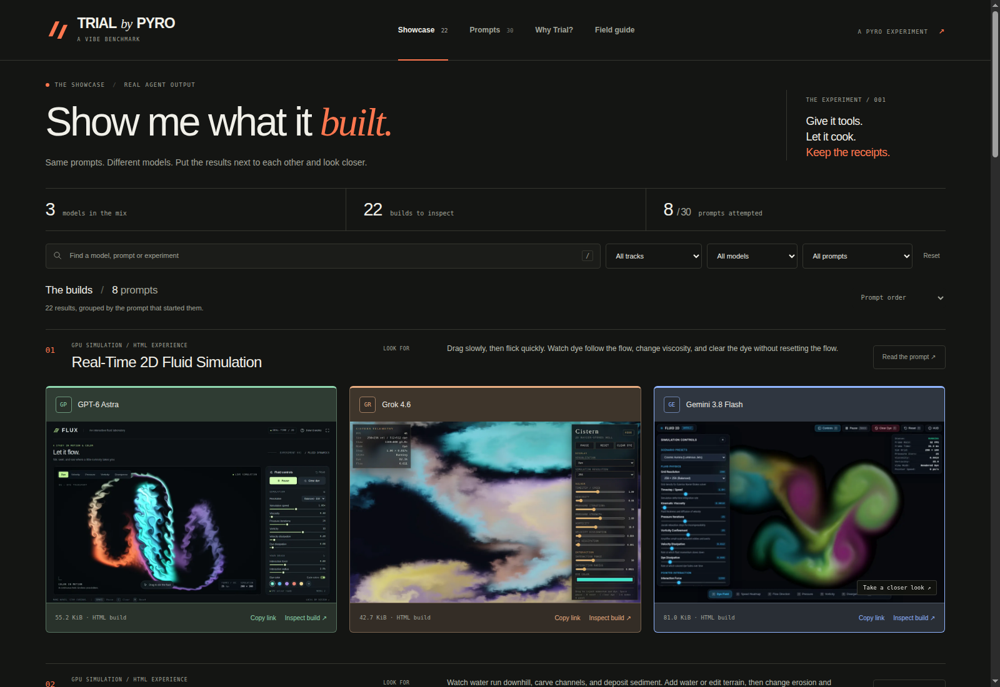
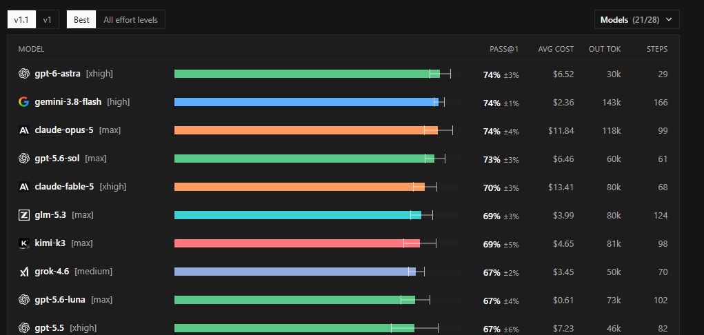

<div align="center">
  <picture>
    <source media="(prefers-color-scheme: dark)" srcset=".github/logo-dark.svg">
    <source media="(prefers-color-scheme: light)" srcset=".github/logo-light.svg">
    
  </picture>
  <h1>Trial - <em>a Vibe Benchmark</em></h1>
  <p><sub>by Pyro</sub></p>
  <p>Show me what it built. Then let me try it.</p>
</div>

<div align="center">

[![30 complete prompts][prompts-shield]][prompts-url]
[![2 tracks][tracks-shield]][tracks-url]
[![Python 3.11+][python-shield]][python-url]

</div>

<div align="center">
  <a href="https://trial-by-pyro.netlify.app/">Live Showcase</a> &middot;
  <a href="#quick-start">Quick Start</a> &middot;
  <a href="prompts/README.md">Prompts</a> &middot;
  <a href="docs/results.md">Results Guide</a> &middot;
  <a href="docs/DEPLOYMENT.md">Hosting</a>
</div>

---



## Why this project?

Let's be clear: **this is not scientific.** Trial is a Vibe Benchmark: a personal collection of hand-picked challenges and the builds that came back. Small sample, human judgment, plenty of taste. It cannot establish a reliable model ranking or prove which model is universally better. It can give you something to try, question, and form your own opinion about. That's the point.

Numerical benchmarks matter. Research and training need guardrails, and a score is useful evidence. I use them. But equal scores do not mean equal experiences with the models behind them.

Look at the Deep-SWE snapshot below. GPT-6 Astra [xhigh] and Gemini 3.8 Flash [high] both display **74%**, with different costs, token usage, and step counts. In my hands, these models don't even feel like they're playing the same game. One percentage compresses a lot of very different work.



*Deep-SWE snapshot. Different effort settings; captured values, not a live ranking.*

What I keep missing in benchmark tables is the chance to try what the model built. Open the app. Push the controls. Follow a workflow until something breaks. You start to recognize a model's style, its strengths, and the things it consistently neglects. That's what I wanted to make easier with Trial.

I like a good voxel world. Those Twitter fly-throughs can show real visual flair. I prefer demos that let me disturb the physics, make decisions in a playable game, play an instrument, or push an interface until it breaks. That exposes cause and effect, strengths, and failure modes. Voxel apps can do all of that too. A pretty camera orbit just hasn't demonstrated it yet.

I chose tasks with enough complexity to make the agent work for it. A couple of model generations ago, I would have budgeted multiple hours for these jobs. In my own Astra runs so far, each has delivered a build in under an hour. That's what I observed in those runs; correctness still has to earn its own evidence.

The tasks also give you an approachable way to judge the result. Does the physics look plausible? Is the game fun? Does the interface hold together? You can form a useful first impression without being a domain expert. Then use the formal checks to see whether that impression survives the requirements. Both kinds of judgment matter.

Keep the benchmarks. Get your hands on the work.

## What you can do

- **Compare the same brief.** Browse three models side by side on desktop, two on smaller screens, or one on mobile. Use the arrows or swipe through the model lineup. **Expand** shows every entry in a grid with as many rows as needed: three columns on desktop, two on smaller screens, and one on mobile, with Look for hints above. Filter by model, task, track, status, or text.
- **Try the output.** Run live HTML builds across the full viewport, or choose desktop, tablet, and mobile sizes. Switch models without leaving the prompt, and open **Look for** when you want a few useful things to try. Download the source to inspect it yourself.
- **Share a build or a whole comparison.** Choose **Copy link** on a card to share its maximized app, or beside a prompt to share the expanded comparison. Category links open all models for that prompt and carry their own title and screenshot preview; individual build links keep their model-specific previews.
- **Run any of the 30 prompts.** Read and copy the complete task, including validation checks and delivery requirements, from the prompt library.
- **Inspect complete applications locally.** Review project source downloads, declared setup commands, notes, and manually started app previews.
- **Keep evaluation honest.** The local gallery shows evaluator checks, source hashes, stale reports, per-track score summaries, and CSV export. Missing scores stay missing.
- **Share a focused showcase.** Export the gallery, public prompts, HTML builds, thumbnails, and small share pages for static hosting. Evaluation records and project archives are excluded from that export.

## When to use it

Use Trial when you want to inspect what a coding model can build, choose challenges for a comparison, or try the same prompt with your own agent. The gallery displays submitted work; an independent evaluator determines whether it meets the brief.

| Track | Tasks | What the agent delivers |
|---|---|---|
| Standalone HTML | 01-20 | One self-contained `index.html`: simulations, games, audio tools, and editors |
| Real Apps | 21-30 | A runnable `project/`: source, tests, a README, and a runtime manifest |

## Quick Start

From the project root, with Python 3.11 or newer:

```sh
python gallery/server.py --open
```

The gallery opens at [127.0.0.1:8765](http://127.0.0.1:8765/). Choose a prompt, compare its builds, and open a result. **Refresh** rescans the results directory.

## Install

The local gallery requires **Python 3.11+** and a modern browser. It uses the Python standard library; there is no package-install or frontend-build step.

On Windows, you can also double-click [`run-gallery.bat`](run-gallery.bat) or run `./run-gallery.ps1`. On macOS or Linux, run `sh run-gallery.sh`. Each Real Apps submission declares its own additional dependencies.

## Usage

### Run a challenge

1. Choose a task from the [prompt library](prompts/README.md) or [task selection guide](prompts/SELECTION_GUIDE.md).
2. Give your agent the entire `prompt.md` and that task's public `fixtures/`, if present, in a separate workspace. Keep `evaluator/` outside it.
3. Let the agent build, run, inspect, and test within your chosen budget. Keep the delivered artifact and its sibling `evidence/` directory for independent evaluation.

Each prompt contains the full workflow. Use comparable tool access and budgets across models; record checks that could not run. The [execution protocol](docs/AGENTIC_PROTOCOL.md) explains the common contract, and the [Real Apps guide](docs/REAL_APPS.md) covers runtime setup and persistent data.

### Add a result

For example, to import an HTML build saved in a sibling `work/` directory:

```sh
python tools/new_run.py --model "Model Name" --run 01-fluid-simulation-001 --task 01-fluid-simulation --html ../work/index.html
```

Then choose **Refresh** in the gallery. Use `--project ../work/project` for a complete application. The [results guide](docs/results.md) covers folder layout, screenshots, model metadata, reports, source hashes, and replacement behavior.

### Customize the gallery

Edit [`gallery/static/appsettings.json`](gallery/static/appsettings.json) to set model names, colors, and order. The default configuration is:

```json
{
  "siteUrl": "https://trial-by-pyro.netlify.app",
  "models": [
    {"key": "gpt-6_astra", "label": "GPT-6 Astra", "color": "#8FD7AF"},
    {"key": "anthropic_opus5", "label": "Opus 5", "color": "#D8ACE7"},
    {"key": "xai_grok4.6", "label": "Grok 4.6", "color": "#E8AD82"},
    {"key": "zai_glm5.3_flash", "label": "GLM 5.3 Flash", "color": "#DED27B"},
    {"key": "google_gemini3.8_flash", "label": "Gemini 3.8 Flash", "color": "#91B5FF"}
  ]
}
```

`key` identifies the model, `label` is its displayed name, and `color` must be a six-digit hex value. Array order controls showcase columns and the model picker. Scores remain sorted by score, with configured order breaking ties. Unlisted models follow the listed models alphabetically and receive stable fallback colors.

`siteUrl` supplies the public origin for link-preview images and canonical share URLs. Set it to your own domain when hosting a copy. This file is public presentation configuration. Choose **Refresh** to reload local settings; redeploy to update the public site.

Record the shared harness and setting in `results/<model>/model.toml`. Cards show the setup beneath the model name; **Setup** in the maximized viewer adds provider and harness links. The current collection uses:

| Model | Harness | Setting |
|---|---|---|
| GPT-6 Astra | [Codex CLI](https://developers.openai.com/codex/cli) | Max |
| Opus 5 | [Claude Code](https://claude.com/product/claude-code) | Max |
| Grok 4.6 | [Cursor Desktop](https://cursor.com/) | High Fast |
| GLM 5.3 Flash | [Pi](https://pi.dev/) | High |
| Gemini 3.8 Flash | [Antigravity CLI](https://antigravity.google/) | High |

These are the settings I used, with their original labels. They describe this collection; they aren't equivalent budgets or a complete record of each run. See the [model setup format](docs/results.md#shared-model-setup) to edit them. Selected setup fields are public; raw run metadata and evidence stay out of the website export.

### Build a public showcase

```powershell
# Windows
./scripts/build-site.ps1
```

```sh
# macOS / Linux
sh scripts/build-site.sh
```

The export is written to `dist/site/`. The [hosting guide](docs/DEPLOYMENT.md) explains optional thumbnail generation and the Netlify scripts, including explicit site selection and draft versus production deployment.

## Read the evidence

The two tracks use different rubrics. Compare matching tasks and budgets before drawing conclusions from scores; a screenshot alone does not establish correctness. [Evaluation](EVALUATION.md) defines the checks and scoring, while the [verification record](docs/VERIFICATION.md) separates tests of this gallery from tests of submitted applications.

The Netlify export omits raw evidence, but GitHub visibility is separate. Files committed to a public repository are public. Review logs, absolute paths, screenshots, and generated source before publishing a submission.

## Contributing

Keep task requirements and public fixtures stable. For gallery or importer changes, include a reproducible example and run the checks in the [verification guide](docs/VERIFICATION.md). For new results, retain the original source and record the model, tools, budget, and observed limitations.

## License

A project license has not been specified.

---

Crafted with [Readme Craft](https://github.com/motiful/readme-craft)

[prompts-shield]: https://img.shields.io/badge/prompts-30-F26B38?style=flat-square
[prompts-url]: prompts/README.md
[tracks-shield]: https://img.shields.io/badge/tracks-2-30343B?style=flat-square
[tracks-url]: #when-to-use-it
[python-shield]: https://img.shields.io/badge/Python-3.11%2B-3776AB?style=flat-square&logo=python&logoColor=white
[python-url]: #install
