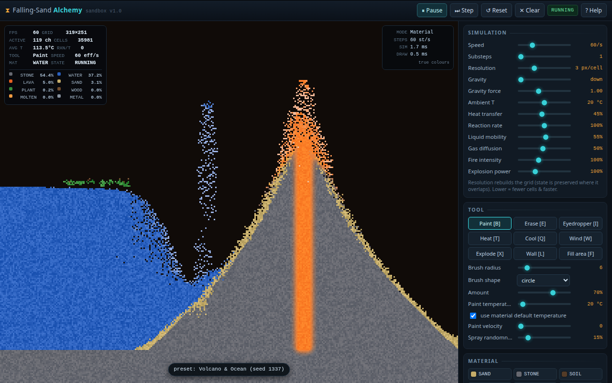

# Falling-Sand Alchemy Sandbox

One HTML file, no dependencies, no build step at runtime: a 30-material
falling-sand world where each cell carries a material, a temperature, a
velocity and (for conductors) an electric charge. Open `index.html` and it
runs at 60 fps.



## Running it

Double-click `index.html`, or

```
python3 -m http.server 8080     # then open http://localhost:8080
```

There are no network requests, no modules, no fetches — `file://` works
exactly as well as http.

## Controls

| Input | Action |
| --- | --- |
| Left drag | paint / use the active tool |
| Right drag | erase, whatever the active tool is |
| Wheel | brush radius |
| `1`–`9`, `0` | the ten quick material slots |
| `B E I T Q W X L F` | paint, erase, eyedropper, heat, cool, wind, explode, wall, fill |
| `Space` | pause / resume · `S` single step · `R` rebuild preset · `C` clear |
| `M` | next diagnostic view |
| `G` | rotate gravity 45° |
| `[` `]` | brush size |
| `H` or `?` | keyboard help |
| `P` | export the view as PNG |
| `O` | download the whole grid as JSON |
| `Tab` | show/hide the control panel |

Touch works too: tap paints, drag paints continuously, and wind/wall/blast
keep pushing along the drag so you do not have to lift your finger.

## What is actually modelled

Each tick runs **electricity → heat → physics**, and each pass reads the
previous tick's fields, so the order cells are visited in never leaks into the
result.

- **Four fields per cell.** Material, temperature in °C, velocity, and charge
  for conductors. Sand poured on hot steel radiates its heat and cools; water
  poured on lava flashes to steam and crusts the lava into stone.
- **Phase changes** are temperature driven: ice↔water↔steam, lava↔stone,
  sand→glass, melting metal and plastic. Heat flows *into* a phase change, so
  melting ice cools its surroundings.
- **Density displacement** — heavier loose material sinks through lighter
  liquid, so oil floats on water and sand sinks through it.
- **Dissolving** — salt and sugar go into brine and keep flowing; acid eats
  metal, glass and ice into slurry and gives off hydrogen.
- **Combustion** needs heat, fuel and a gas gap. Dense timber smoulders
  (26 ticks per cell), an open lattice flares, and burning plastic rains
  burning oil. Fire that buries itself in fuel without any air dies, which is
  why a solid block chars from the surface in.
- **Electrical conduction** spreads through water, metal, salt water, char,
  charcoal and plant matter. Live gunpowder detonates, live water
  electrolyses, current arcs 2–3 cells through gaps and dies after 14 hops.
- **Explosions** are expanding pressure rings. Cells caught in the front are
  pushed *and* heated, so a blast leaves a crater and a shock of flame rather
  than just deleting cells. The pressure ring keeps expanding and re-ignites
  whatever it overtakes.
- **Vents.** Some cells keep pumping material (a magma conduit, a spring, a
  steam leak) so scenes stay interesting instead of relaxing into a still
  life.
- **Plant growth** consumes water, creeps across damp substrate, dries out and
  bums if it gets too hot.

## Layout

```
src/shell.html   markup, with /*__STYLE__*/ and /*__SIM__*/ placeholders
src/style.css  all the styling
src/sim.js     the engine — deliberately free of any DOM reference
src/ui1.js     rendering: 8 view modes, LUT palettes, canvas blitting
src/ui2.js     presets + the main loop
src/ui3.js       pointer/keyboard/UI wiring, save/load, autosave
```

`python3 evidence/build.py` concatenates those into `index.html`. Everything
shares one global scope in the output, which is why sim.js can be tested on
its own.

`index.html` is the artefact and is committed. Edit `src/`, then rebuild.

## Performance notes

- Cells live in flat typed arrays sized to the grid (material, temperature,
  velocity, lifetime, charge, flags, colour jitter, update order, reaction
  glow). Roughly 3 MB for the default 1280×800 grid.
- Activity is tracked in 16×16 chunks with a double-buffered list. Cells that
  cannot move are not visited: the volcano scene idles at ~78 active chunks
  out of 132.
- Movement wakes **both** ends of a move, and once per cell per tick, so a new
  batch of chunks does not lose wakes — that used to freeze whole worlds.
- Heat diffusion is double buffered; electrical conduction uses a 40 000-entry
  queue pair that spills to a fallback sweep if it overflows.
- Rendering blits one `ImageData` per frame (32-bit writes, no per-cell
  `fillRect`), then scales it up with a smoothed `drawImage`. Device-pixel-ratio
  aware up to 2.5.

## Development and tests

```
./evidence/run-node-tests.sh   # 32 headless engine checks, no browser
./evidence/browser-check.sh    # full pass in Chrome, ~5 min
```

`test-sim.js` is appended to `sim.js` and run under Node — possible only
because the engine never touches the DOM. It covers gravity and pile
formation, liquid levelling, density layering, dissolving, quenching,
combustion chains, corrosion, conduction, freezing and melting, plant growth,
blast impulse, gas rise, gravity rotation, the save codec and a performance
budget.

`browser-check.sh` drives a real Chrome through `agent-browser` at 1280×800
and 390×844. Every check follows *real* input — mouse drags across the canvas,
key presses on the page, keyboard interaction with the sliders — and it fails
the run if a console error appears, if the canvas stops changing, or if
`window.FSA` ever disappears, which is how it catches a page that died
silently. Screenshots and `run.log` land in `evidence/shots/`.

`window.FSA` is a small debug/test handle (see the end of `src/ui3.js`):
`stats`, `cell`, `region`, `paint`, `drag`, `explode`, `mode`, `set`, `hash`,
`step`, `pause`, `clear`, `preset`, `count`, `encode`, `load`.

## What is deliberately left out

- **No pressure model for water.** A deep column drains because the bottom
  cells are less dense than the pile, not because of head pressure. A proper
  hydraulic column would need a fifth field.
- **No mixed substances.** Salt water is its own material, not water+salt.
  This keeps the colour map honest and costs one byte per cell.
- **No exact gas dosing.** Hydrogen and oxygen from electrolysis are single
  "flammable gas" cells; a mixture would need per-cell composition.
- **No Worker/offscreen canvas.** The whole sim runs on the main thread. At
  80k cells that is 0.3–1 ms per tick, so a thread boundary would cost more
  in message passing than it saves.
- **No undo.** The autosave is the only rewind; it restores the last saved
  snapshot, not a step-by-step history.

## Saving and sharing state

- Save writes a 30–120 KB JSON blob containing material runs, temperatures
  and velocities. Loading it rebuilds the identical grid, so scenes are
  reproducible.
- Autosave keeps the last snapshot in `localStorage` and restores it on load,
  so an experiment survives a refresh. Turn it off in the Data panel if you
  would rather every reload start from the preset.
- Determinism: presets take a seed. The same seed builds the same scene, and
  identical seeds produce identical results regardless of load order.
